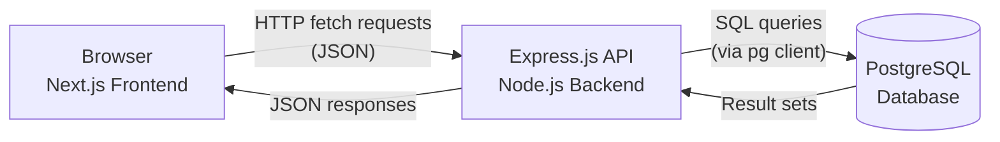

# System Architecture

Veltrix is built using a standard 3-tier architecture, separating the presentation layer (Frontend), the application logic layer (Backend), and the data layer (Database). The reason for keeping these three tiers separate is straightforward — the frontend never talks to the database directly and the database doesn't need to know anything about how the UI works. It keeps things easier to debug and change independently.

### Tier 1: Presentation Layer (Frontend)

* **Role:** Handles all user interaction, rendering, client-side routing, and state management.
* **Technology:** **Next.js** (React) and **TailwindCSS**.
* **Data Flow:** Communicates with the Backend API exclusively via HTTP requests (e.g., `fetch` calls through custom hooks like `useTrades` and constants like `FETCH_URL`).

### Tier 2: Application Layer (Backend)

* **Role:** Exposes a RESTful API, manages business logic (e.g., user authentication, trade calculation), and acts as a secure intermediary between the frontend and the database.
* **Technology:** **Node.js** with the **Express.js** framework.
* **Key Responsibilities:**
    * Route handling and request parsing.
    * User registration, login, and email verification using `bcryptjs`, `crypto`, and `resend`.
    * Database connection management using the `pg` client.

### Tier 3: Data Layer (Database)

* **Role:** Persistent storage for all application data (user accounts, trades, tags, sessions).
* **Technology:** **PostgreSQL**.
* **Access:** Managed by the backend via the `pg` library and configured using the `DATABASE_URL` environment variable. The schema defines tables for `users`, `trade`, `session`, and various junction tables.

## Data Flow Diagram (3-Tier Model)

The flow is uni-directional from the browser to the database. The Express.js API is the only thing that talks to PostgreSQL directly — the frontend never bypasses it.

---

## Summary

| Layer | Technology | Responsibility |
|---|---|---|
| Presentation | Next.js, TailwindCSS | UI rendering, routing, state |
| Application | Node.js, Express.js | API, business logic, auth |
| Data | PostgreSQL | Persistent storage |